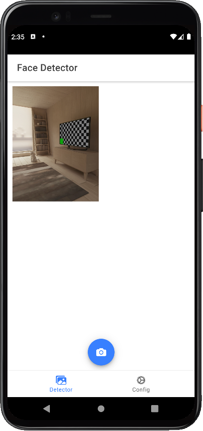
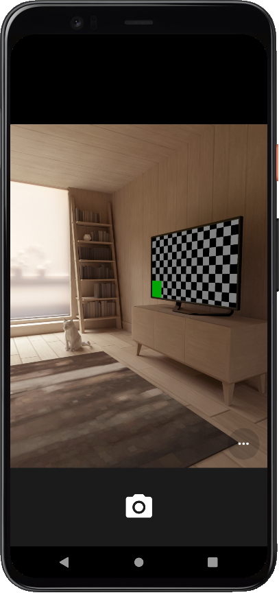

# Detector Application

## How It Works

After the user navigates to Detector tab, they can tap/click on the camera button to open up the device's camera. After taking or selecting a photo, it's stored permanently into the device's filesystem. When the user reopens the app at a later time, the photo images are loaded from the filesystem and displayed again in the gallery.

## Feature Overview
* App framework: [Angular](https://angular.io)
* UI components: [Ionic Framework](https://ionicframework.com/docs/components)
  * Camera button: [Floating Action Button (FAB)](https://ionicframework.com/docs/api/fab)
  * Photo Gallery display: [Grid](https://ionicframework.com/docs/api/grid)
  * Delete Photo dialog: [Action Sheet](https://ionicframework.com/docs/api/action-sheet) 
* Native runtime: [Capacitor](https://capacitor.ionicframework.com)
  * Taking photos: [Camera API](https://capacitor.ionicframework.com/docs/apis/camera)
  * Writing photo to the filesystem: [Filesystem API](https://capacitor.ionicframework.com/docs/apis/filesystem)
  * Storing photo gallery metadata: [Storage API](https://capacitor.ionicframework.com/docs/apis/storage)

## Configuration

	## Template
	$ ionic start camera tabs --type=angular --capacitor
	$ cd camera
	
	## Installing Capacitor and PWA frameworks
	$ npm install @capacitor/camera @capacitor/storage @capacitor/filesystem
	$ npm install @ionic/pwa-elements
	
	## Generating photo service template
	$ ionic generate service services/photo
	
	## 
	

## Running in emulator

    $ ionic cap run android -l --external

## Application overview
After opening the application, click the 'Camera' bottun. Then, one can take the photo and can analyze it.

## Reference

 * https://ionicframework.com/docs/angular/your-first-app

## History

 * Ver. 0.1 - 2022.Apr.08, Prototype for a testbed.

## License

